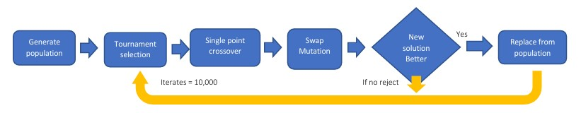

# Evolutionary-Algorithms-for-Traveling-Salesman-Problem

This project investigates the application of Evolutionary Algorithms (EAs) to solve the Traveling Salesman Problem (TSP), an optimization challenge where the objective is to find the shortest route that visits a set of cities exactly once and returns to the starting point. The implementation is developed using Python and evaluates the performance of various EA configurations on datasets representing city maps from Brazil and Burma.

## The Evolutionary Algorithm
The Evolutionary Algorithm (EA) for solving the Traveling Salesman Problem (TSP) in this project begins with generating an initial population of random solutions and assessing their fitness based on the total travel cost derived from a distance matrix. The algorithm proceeds as follows:

- **Generate Population**: Create an initial set of random solutions.
- **Tournament Selection**: Select parents for crossover.
- **Single-Point Crossover**: Produce offspring by combining parent solutions.
- **Swap Mutation**: Introduce variation by swapping genes in the offspring.
- **Fitness Check**: Evaluate if the new solution is better.
- **Replacement**: Incorporate the fittest offspring into the population, replacing existing members.
- **Iteration**: Repeat the process for 10,000 fitness evaluations or until the termination criterion is met to evolve towards the optimal TSP route.

 

 # Evolutionary Algorithms for Traveling Salesman Problem (TSP)

## Summary
This project investigates the application of **Evolutionary Algorithms (EAs)** to solve the **Traveling Salesman Problem (TSP)**, using city map datasets from **Brazil** and **Burma**. The EA implemented follows a structured process involving population generation, tournament selection, crossover, mutation, and iterative solution refinement to find the shortest route.

### Key Findings:
- **Crossover Operators**:
  - **Ordered Crossover** improves solution quality, especially for simpler datasets, though it may increase computational time.
- **Mutation Strategies**:
  - **Inversion Mutation** effectively maintains genetic diversity, helping the algorithm avoid local optima.
- **Population and Tournament Size**:
  - Smaller tournament sizes promote diversity, leading to improved solutions. Larger populations can enhance solution quality but require more computational resources.
- **Iterations**:
  - Higher iteration counts are beneficial for complex datasets like **Brazil**, enabling more comprehensive exploration and convergence.

### Recommendations:
To enhance the algorithm's effectiveness:
- Experiment with hybrid approaches that integrate local search methods.
- Adjust mutation rates dynamically or explore variable population sizes.
- Investigate alternative optimization algorithms such as **Ant Colony Optimization** or **Particle Swarm Optimization** for potentially superior results.

This project underscores the importance of tailoring EA parameters to the problem's complexity to achieve optimal performance.

